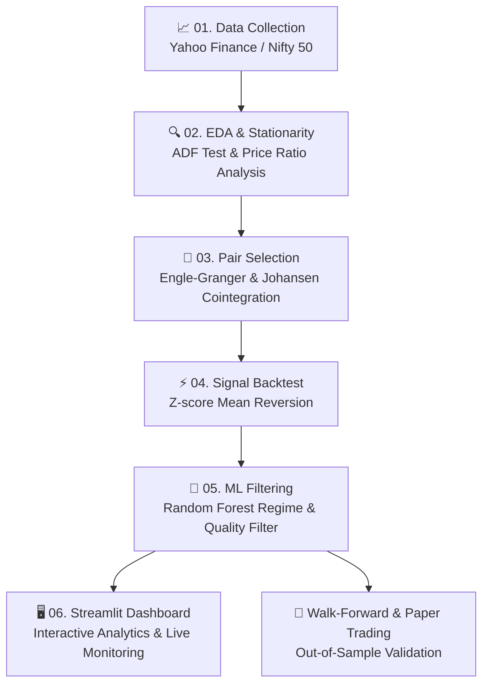
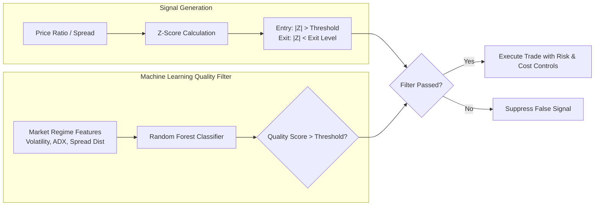

# 📈 Quantitative Pair Trading with Cointegration & ML Filtering

[](https://www.python.org/downloads/)
[](https://streamlit.io/)
[](https://opensource.org/licenses/MIT)

> An end-to-end algorithmic quantitative pair trading framework built on **Engle-Granger Cointegration**, **Z-score Mean Reversion Signals**, and **Random Forest Machine Learning Filters**. Includes interactive Streamlit analytics, walk-forward optimization, risk controls, transaction cost simulation, and paper trading capabilities.

---

## 📑 Table of Contents
- [📌 System Architecture & Pipeline](#-system-architecture--pipeline)
- [⚡ Quick Start & Setup](#-quick-start--setup)
- [🔁 Pipeline Execution Order](#-pipeline-execution-order)
- [📊 Interactive Dashboard](#-interactive-dashboard)
- [📁 Key Outputs & Verification](#-key-outputs--verification)
- [🛠️ Troubleshooting & Common Fixes](#️-troubleshooting--common-fixes)

---

## 📌 System Architecture & Pipeline



### 🧠 Core Algorithmic Components



---

## ⚡ Quick Start & Setup

### 1. Prerequisites
* **Python 3.10+**
* **VS Code** with Python & Jupyter Extensions installed

### 2. Environment Setup

#### **Windows (PowerShell)**
```powershell
# 1. Create Virtual Environment
python -m venv .venv

# 2. Activate Virtual Environment
.\.venv\Scripts\Activate.ps1

# 3. Upgrade Pip & Install Dependencies
python -m pip install --upgrade pip
python -m pip install -r requirements.txt
```

#### **macOS / Linux**
```bash
# 1. Create Virtual Environment
python -m venv .venv

# 2. Activate Virtual Environment
source .venv/bin/activate

# 3. Upgrade Pip & Install Dependencies
python -m pip install --upgrade pip
python -m pip install -r requirements.txt
```

---

## 🔁 Pipeline Execution Order

Execute the Jupyter Notebooks sequentially in `notebooks/` from top to bottom. Each stage relies on artifacts produced by the previous step:

| Step | Notebook | Description | Output Artifact |
| :--- | :--- | :--- | :--- |
| 1️⃣ | [`notebooks/01_data_collection.ipynb`](notebooks/01_data_collection.ipynb) | Fetches clean stock price history from `yfinance`. | `data/nifty_prices_clean.csv` |
| 2️⃣ | [`notebooks/02_eda_pairs.ipynb`](notebooks/02_eda_pairs.ipynb) | Analyzes spread stationarity and correlation. | EDA plots & stats |
| 3️⃣ | [`notebooks/03_pair_selection.ipynb`](notebooks/03_pair_selection.ipynb) | Runs Engle-Granger tests to filter cointegrated pairs. | `data/selected_pairs.csv` |
| 4️⃣ | [`notebooks/04_signal_backtest.ipynb`](notebooks/04_signal_backtest.ipynb) | Backtests baseline Z-score mean-reversion strategy. | `data/baseline_backtest_stats.csv` |
| 5️⃣ | [`notebooks/05_ml_filter_random_forest.ipynb`](notebooks/05_ml_filter_random_forest.ipynb) | Trains ML classifier to reduce drawdown & false signals. | `data/ml_vs_baseline_stats.csv` |

> [!NOTE]  
> If using the alternate Phase 3 methodology, run [`notebooks/03_pair_selection1.ipynb`](notebooks/03_pair_selection1.ipynb) instead of notebook 3.

---

## 📊 Interactive Dashboard

Launch the Streamlit Web Application to visualize pair performance, equity curves, drawdown curves, and live trade signals:

```powershell
python -m streamlit run dashboard.py --server.port 8501
```

Access the UI at: **`http://localhost:8501`**

### Dashboard Features
- 📈 **Interactive Pair Explorer:** View dynamic price ratios, Z-scores, and cointegration statistics.
- ⚖️ **Baseline vs ML Strategy Comparison:** Equity curves, Sharpe ratios, and max drawdown comparison tables.
- 🛡️ **Risk & Cost Analytics:** Slippage, brokerages, and stop-loss impact simulations.
- 📡 **Live Signal Monitor:** Real-time z-score thresholds and entry/exit triggers.

---

## 📁 Key Outputs & Verification

Upon completing all notebook runs, verify that the following core files exist:

- `data/nifty_prices_clean.csv` — Clean historical price dataset
- `data/selected_pairs.csv` — Statistically verified cointegrated pairs
- `data/baseline_backtest_stats.csv` — Unfiltered Z-score backtest metrics
- `data/ml_vs_baseline_stats.csv` — Machine Learning enhanced strategy metrics
- `outputs/06_ml_equity_and_importance.png` — ML feature importance & equity comparison plots

---

## 🛠️ Troubleshooting & Common Fixes

> [!TIP]
> **Missing Dependencies:**  
> Run `python -m pip install <package_name>` inside your active virtual environment.

> [!WARNING]
> **Data Download Errors:**  
> If a stock ticker fails in `yfinance`, update the ticker symbol list in `notebooks/01_data_collection.ipynb` and re-run the pipeline.

> [!IMPORTANT]
> **Missing Downstream Data Files:**  
> Notebooks must be run sequentially in order. If a file is missing, re-run from Phase 1.
